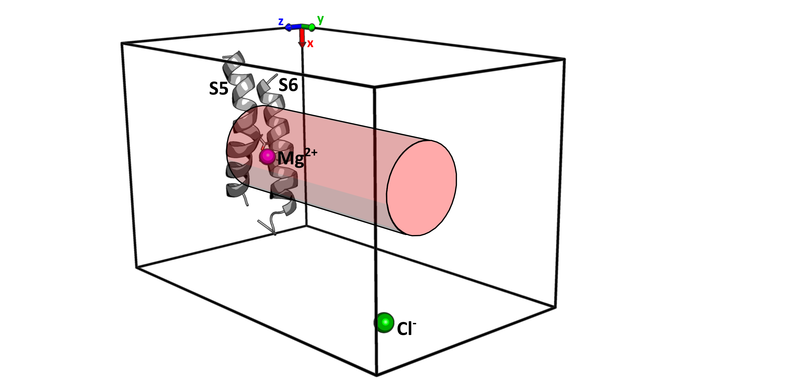
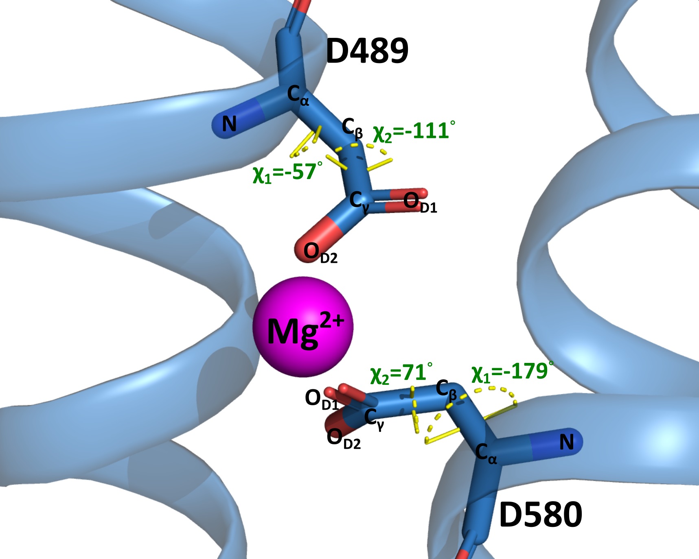
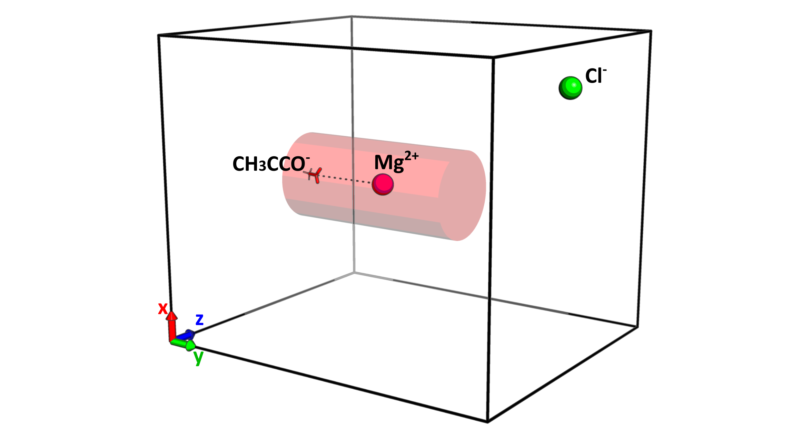

# The locking ****mechanism**** of human TRPV6 **inhibition by intracellular magnesium**

This repository contains the well-tempered metadynamics data and postprocessing conducted in the article

> Neuberger, A., Shalygin, A., Veretenenko, I. I., Trofimov, Y. A., Gudermann, T., Chubanov, V., Efremov, R. G., & Sobolevsky, A. I. (2025). **The locking mechanism of human TRPV6 inhibition by intracellular magnesium**. *Nature Communications*

# Model system

In this study, we investigated magnesium (Mg²⁺) and calcium (Ca²⁺) binding to the D489-D580 site in TRPV6 ion channel using two model systems:

* **Protein system (`PS/` folder)** with site in magnesium-bound conformation
* **Protein apo-sytem (`PS-apo/` folder)**, where the site was not adapted to Mg²⁺

**System composition**:

* S5-S6 transmembrane helices bundle (residues 477-501 and 568-592) containing D489-D580 site
* Mg²⁺ or Ca²⁺ constrained within a cylinder (radius = 0.9 nm)
* Cl- contrion
* 5550 water molecules in a 5×8×5 nm³ box

# WTMetaD simulation protocol

In this work, well-tempered metadynamics (WTMetaD) approach was implemented to calculate standard binding free energy of Mg²⁺ or Ca²⁺ binding to D489-D580 site.

> * Input files for performing WTMetaD simuations can be found in folders `MDRUN/` in each system folder.
> * PDB files with 21 frames of WTMetaD trajectories of each walker (0-2000 ns, step 100 ns) can be found in `STATE_PDB/` folder.

## Force Field Parameters

* Electronic continuum correction (ECC) approach with scaled charges:
  * Mg²⁺: scaling factor (SF) = 0.8
  * Ca²⁺: SF = 0.85 or 0.8
* Protein: Amber-99sd-ildn FF with corresponding SF
* SPC/E water model

## Simulation Details

- Software: GROMACS 2024.3 + PLUMED 2.9.2
- Multiple walkers configuration (4 walkers)
- Simulation time: PS: 8 μs (4 walkers × 2 μs)
- Parameters:
  - Bias factor: 5
  - Gaussian height: 0.3 $k_BT$
  - Gaussian widths: 0.5 Å for $L_1$, $L_2$, 0.1 for $CN_W$

# WTMetaD postprocessing

All postprocessing steps including reweighting procedure and obtaining images for the article was provided using jupyter notebook `PS-systems-postprocessing.ipynb`. Its stored copies for PS and PS-apo systems can be found in `NOTEBOOKS/` folder.

## Scripts

1. `BASHRC/plotstring.sh --> SCRIPTS/plotstring.py` - calculating **Minimum Free Energy Path (MFEP)** using String method
2. `BASHRC/block_prot.sh --> SCRIPTS/block_prot.py` - **Block analysis** for checking convergence and error estimation of ΔG⁰ values

## Standard binding free energy (ΔG⁰) calculation

`SCRIPTS/func_main.py`

$\Delta G^0 = \Delta G_{PMF} + \Delta G_{V} + \Delta G_I$

Where:

- $ΔG_{PMF}$: From potential of mean force (PMF) profiles

  $\Delta G_{PMF}=RT\ln(\frac{\int_{unbound}{e^{-PMF(x_1)/RT}}dx_1}{\int_{bound}{e^{-PMF(x_1)/RT}}dx_1})$
- $ΔG_{V}$: Volume correction term

  $\Delta G_V=-RT\ln(\frac{l_uS_u}{V^0}), S_u = \pi R_{cyl}^2+2\pi \left(\sqrt{\frac{\pi RT}{2K_{res}}}R_{cyl}^2 + \frac{RT}{K_{res}} \right)$
- $ΔG_{I}$: Ionic strength correction

  $\Delta G_I = RT \ln{\frac{\gamma_{cation}\gamma_{site}}{\gamma_{cation-site}}}$

## **Conformational sampling of dihedral angles**

To ensure the reliability of WTMetaD-simulations results, we examined conformational sampling of the D489 and D580 side-chain dihedral angles.

1. To characterize the available conformational space in the PS system, we performed an unbiased MD simulation without any cation in the site (`PS/MD_free`, 5 μs). The distributions of the χ1 (N-Cα-Cβ-Cγ) and χ2 (Cα-Cβ-Cγ-OD1) dihedral angles D489 and D580 residies were calculated in `Dihedral_MDfree.ipynb`
2. Foa reweighting procedure was performed to project FES onto the χ1-χ2 plane in `Dihedral_angles_reweighting.ipynb`. The results for the PS and PS-apo systems are saved in folder `NOTEBOOKS/Dihedral`.

# Validation of simulation protocol

## AS-system

This system was constructed for validating force field parameters and simulation protocols against experimental binding free energies provided by [(Oliviera, 2020)](https://doi.org/10.1039/D0CP02987D).

**System composition**:

- Acetate ion
- Cation (Mg²⁺ or Ca²⁺) constrained within a cylinder (radius = 0.7 nm)
- Cl- counterion
- 4460 water molecules in a 5×6×5 nm³ box

## WTMetaD protocol and postprocessing

* The same input and output files as for PS systems are provided for AS-system (folders ` MDRUN/` and ` STATE_PDB/`)
* All postprocessing steps including reweighting procedure and obtaining images for the article was provided using jupyter notebook   `AS-systems-postprocessing.ipynb `
